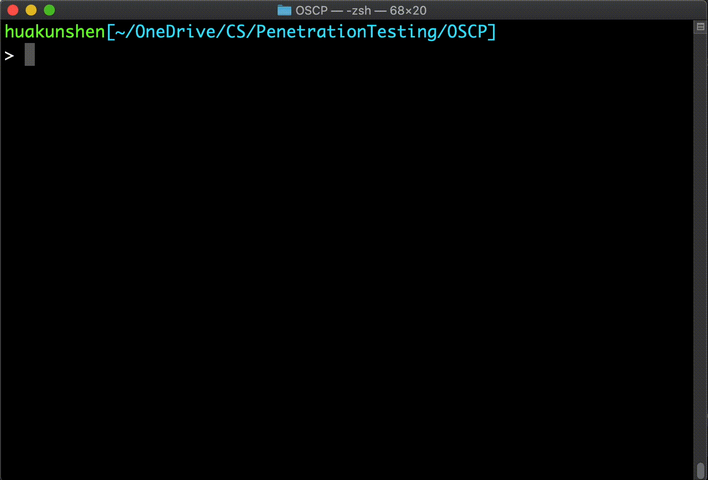
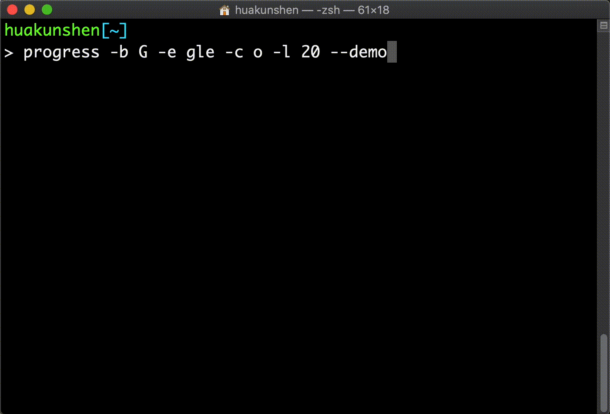
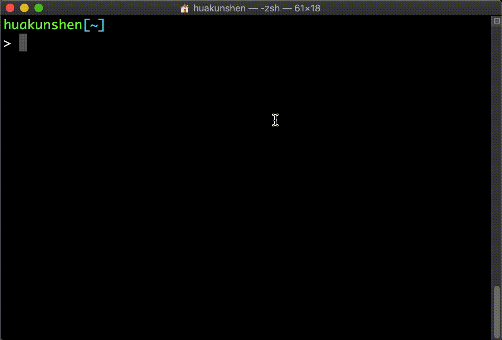

# Toolbox

> Tools for various purposes

## Programs

### Shell

#### [videoLen](./bin/videoLen):

- Calculate video length of a specified video
- Calculate total duration of all videos in the specified directory

Default video types: `mp4, mov, avi`
Video type/extension can be specified manually

**Dependency:** `progress`

**Example:**

```bash
videoLen --dir <directory of videos> --quiet --default
videoLen --dir <directory of videos> --quiet mp4 mov
```

##### Demo



##### Installation

[install.videoLen.sh](./installation/install.videoLen.sh)

```bash
wget https://raw.githubusercontent.com/HuakunShen/Toolbox/master/installation/install.videoLen.sh
chmod a+x install.videoLen.sh
./install.videoLen.sh
rm ./install.videoLen.sh
```

##### Uninstallation

[uninstall.videoLen.sh](./installation/uninstall.videoLen.sh)

```bash
wget https://raw.githubusercontent.com/HuakunShen/Toolbox/master/installation/uninstall.videoLen.sh
chmod a+x uninstall.videoLen.sh
./uninstall.videoLen.sh
rm ./uninstall.videoLen.sh
```

#### [progress](./bin/progress):

- Display a progress bar
- Have customized config for progress bar styling

**Dependency:** _None_

**Example:**

```bash
progress 25 100
# [##########________________________________________](100%)
progress --begin G --end gle --char o --length 10 --demo
# Go________ogle(100%)
# Goo_______ogle(100%)
# Gooo______ogle(100%)
# ...
# Goooooooooogle(100%)
progress <dir of videos> --begin G --end gle --char o --length 60
```

##### Demo






##### man

[man page](./man/progress.1)

[man page .gz](./man/progress.1.gz)

##### Installation

[install.progress.sh](./installation/install.progress.sh)

```bash
wget https://raw.githubusercontent.com/HuakunShen/Toolbox/master/installation/install.progress.sh
chmod a+x install.progress.sh
./install.progress.sh
rm ./install.progress.sh
```

##### Uninstallation

[uninstall.progress.sh](./installation/uninstall.progress.sh)

```bash
wget https://raw.githubusercontent.com/HuakunShen/Toolbox/master/installation/uninstall.progress.sh
chmod a+x uninstall.progress.sh
./uninstall.progress.sh
rm ./uninstall.progress.sh
```

## Settings

### [.zshrc](./setting/zshrc.sh):

`.zshrc` is for `zsh`, for Mac.

- Contains `PROMPT` settings
- Helper function `mcd`, `cd` into a dir, `mkdir` if not exist
- Helper function `search`, run `grep -Rn <search-content> <target-dir>`, "target-dir" is optional, search cwd by default

##### Installation

```bash
wget https://raw.githubusercontent.com/HuakunShen/Toolbox/master/setting/zshrc.sh
cat zshrc.sh >> ~/.zshrc
rm zshrc.sh
```

### [.bashrc](./setting/bashrc.sh):

- Contains `PS1`/`Command Prompt` setting
- Contains optional sample alias app for Linux subsystem under Win10

##### Installation

```bash
wget https://raw.githubusercontent.com/HuakunShen/Toolbox/master/setting/bashrc.sh
cat bashrc.sh >> ~/.bashrc
rm bashrc.sh
```

[crontab template](./setting/crontab.sh):

- crontab is for periodic tasks
- Contains contab template
- `crontab -e` to edit
